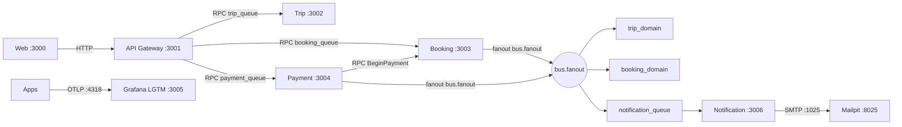
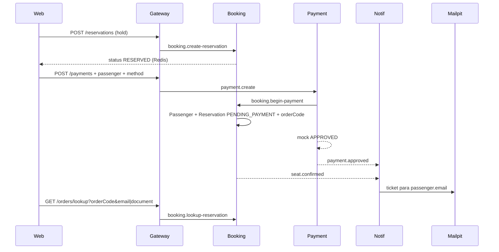

# Arquitetura — Bus Booking Platform

Fonte visual viva. Atualizar junto com mudanças de serviço, messaging ou fluxo (ver rule `docs-architecture`).

## Visão geral

## Domínio (donos)

| Dado | Dono |
|------|------|
| Trip / Seat | Trip Service |
| Hold (Redis) + Reservation + Passenger | Booking Service |
| Payment | Payment Service |
| E-mail | Notification Service |

- Hold não pago: **só Redis** + evento `seat.reserved` (sem row de Reservation).
- Postgres: Reservation entra em `PENDING_PAYMENT` no `beginPayment`, com `Passenger` relacionado.
- Depois: `CONFIRMED` / `CANCELLED` / `EXPIRED`.

## Fluxo guest checkout

## Filas e topics

| Tipo | Nome |
|------|------|
| RPC | `trip_queue`, `booking_queue`, `payment_queue` |
| Fanout | `bus.fanout` → `trip_domain`, `booking_domain`, `notification_queue` |
| Eventos | `seat.reserved`, `seat.confirmed`, `seat.released`, `payment.approved`, `payment.failed` |

## Contratos

- `@repo/common` — DTOs HTTP/RPC, topics, queues
- `@repo/events` — payloads fanout + `EXCHANGE` / `EXCHANGE_TYPE`

## Garantias (lab)

| Tema | Como |
|------|------|
| Concorrência assento | `UPDATE Seat WHERE AVAILABLE` + Redis `SET NX` no assento |
| Idempotência hold | Header `Idempotency-Key` → Redis `SET NX` + unique em Reservation |
| Idempotência pagamento | Key estável `pay-{reservationId}` + unique key + no máximo 1 PENDING/APPROVED por reserva |
| Confirm atômico | `updateMany` só se `PENDING_PAYMENT` + Seat → `SOLD` na mesma tx |
| Checkout vs TTL | `refresh` Redis no `beginPayment` (janela extra) |

Aceitável no lab (não overengineer): `availableSeats` eventual; fanout at-least-once (handlers idempotentes); sem outbox/saga.
