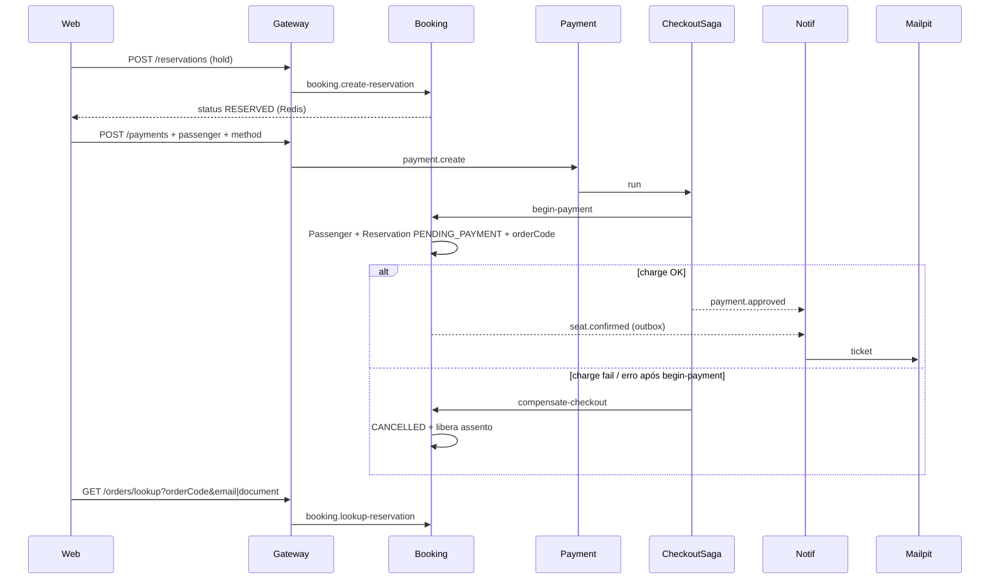

# Arquitetura — Bus Booking Platform

Fonte visual viva. Atualizar junto com mudanças de serviço, messaging ou fluxo (ver rule `docs-architecture`).

## Visão geral

## Domínio (donos)

| Dado                                            | Dono                 |
| ----------------------------------------------- | -------------------- |
| Trip / Seat                                     | Trip Service         |
| Hold (Redis) + Reservation + Passenger + Outbox | Booking Service      |
| Payment                                         | Payment Service      |
| E-mail                                          | Notification Service |
| PspWebhookEvent                                 | Payment Service      |

- Hold não pago: **só Redis** + evento `seat.reserved` (sem row de Reservation).
- Postgres: Reservation entra em `PENDING_PAYMENT` no `beginPayment`, com `Passenger` relacionado.
- Depois: `CONFIRMED` / `CANCELLED` / `EXPIRED`.

## Fluxo guest checkout

## Filas e topics

| Tipo    | Nome                                                                                           |
| ------- | ---------------------------------------------------------------------------------------------- |
| RPC     | `trip_queue`, `booking_queue`, `payment_queue`                                                 |
| Topic   | `bus.topic` → bindings por routing key → `trip_domain`, `booking_domain`, `notification_queue` |
| Eventos | `seat.reserved`, `seat.confirmed`, `seat.released`, `payment.approved`, `payment.failed`       |

## Contratos

- `@repo/common` — DTOs HTTP/RPC, topics, queues
- `@repo/events` — payloads + `EXCHANGE` / `EXCHANGE_TYPE` (`bus.topic`)

## Garantias (lab)

| Tema                     | Como                                                                                                         |
| ------------------------ | ------------------------------------------------------------------------------------------------------------ |
| Concorrência assento     | Trip: `UPDATE Seat WHERE AVAILABLE`; Booking: Redis `SET NX` no assento                                      |
| Idempotência hold        | Header `Idempotency-Key` → Redis `SET NX` + unique em Reservation                                            |
| Idempotência pagamento   | Key estável `pay-{reservationId}` + unique key + no máximo 1 PENDING/APPROVED por reserva                    |
| Webhook PSP              | `POST /webhooks/psp` + `PspWebhookEvent.providerEventId` unique; só `PENDING`→`APPROVED`/`FAILED`            |
| Confirm atômico          | `updateMany` só se `PENDING_PAYMENT` + outbox `seat.confirmed` na mesma tx                                   |
| Checkout vs TTL          | `refresh` Redis no `beginPayment` (janela extra)                                                             |
| Outbox (Booking/Payment) | Evento em `OutboxEvent` na mesma tx; relay publica; `attempts`/`poisonedAt` após 5 falhas                    |
| Saga checkout            | Payment orquestra: beginPayment → charge (ou `asyncCharge` + webhook) → event; falha → `compensate-checkout` |
| DLQ domain               | `nack(requeue=false)` → DLX `bus.dlx` → `{queue}.dlq`; prefetch 10                                           |
| Rate limit               | Gateway: 20/min em payments/lookup; 60/min em webhooks/psp                                                   |
| Healing                  | Booking: PENDING_PAYMENT órfão; Trip: HELD stale                                                             |

Aceitável no lab (não overengineer): `availableSeats` eventual; sem 2PC; **um Postgres** com tabelas por serviço (`OutboxEvent` no Booking, `PaymentOutboxEvent` no Payment); e-mail pode duplicar sob at-least-once.

Migrations limpas (1 por serviço): `trip_init` → `booking_init` → `payment_init`.

**Nota Rabbit:** ao mudar de `bus.fanout` → `bus.topic` ou args de DLX, delete filas antigas na UI (`trip_domain`, `booking_domain`, `notification_queue`) e reinicie os serviços.
